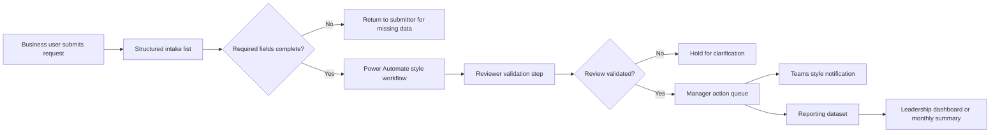

# Solution Architecture

## Workflow name

Operational Review and Callback Tracker

## Goals

- Reduce manual follow-up tracking
- Improve review accountability
- Keep reporting fields stable
- Make manager action status visible
- Separate testing from production changes
- Preserve auditability for compliance-sensitive work

## Context diagram

## Key design decisions

| Decision | Rationale |
|---|---|
| Use structured choice fields instead of free text for review status | Improves consistency and reporting reliability |
| Use UX indicators instead of extra automation where possible | Reduces deployment complexity and flow risk |
| Keep Month and Status reporting fields stable | Protects leadership reporting continuity |
| Separate Development and Production lists | Supports safe testing and controlled deployment |
| Use explicit validation before manager action | Reduces risk of acting on unreviewed records |

## Data flow

1. Request is captured in a structured list.
2. Required fields are validated.
3. Workflow sends notification only when intake quality is sufficient.
4. Reviewer confirms whether the record is valid for manager action.
5. Manager visibility field displays readiness status.
6. Reporting fields remain stable for monthly summaries.

## Governance controls

- Required fields for critical workflow steps
- No default selection for validation field
- Dev/Prod separation for testing
- Change log for schema and flow updates
- Rollback plan for production changes
- Plain-language user communication
